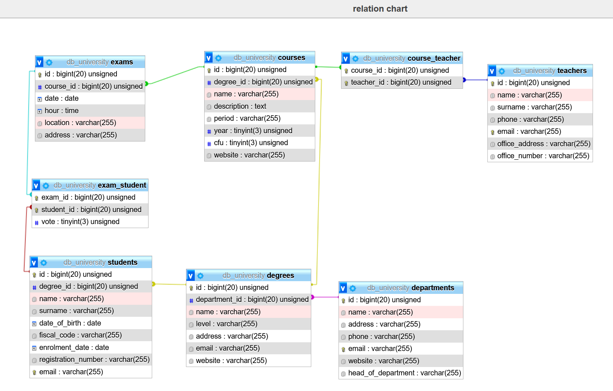

## Schema di riferimento

### Contare quanti iscritti ci sono stati ogni anno
```bash
    SELECT YEAR(`enrolment_date`),COUNT(`id`) 
    FROM `students` 
    GROUP BY YEAR(`enrolment_date`);
```
### Contare gli insegnanti che hanno l'ufficio nello stesso edificio
```bash
    SELECT `office_address`, COUNT(`id`) 
    FROM `teachers` 
    GROUP BY `office_address`;
```
### Calcolare la media dei voti di ogni appello d'esame
```bash
    SELECT `exam_id`, AVG(`vote`)
    FROM `exam_student`
    GROUP BY `exam_id`;
```
### Contare quanti corsi di laurea ci sono per ogni dipartimento
```bash
    SELECT `department_id`, COUNT(`id`) 
    FROM `degrees`
    GROUP BY `department_id`;
```
- query più strutturata per mostrare il nome 
```bash
    SELECT `departments`.`name`, COUNT(`degrees`.`id`) AS 'degrees number'
    FROM `departments` 
    JOIN `degrees`
    ON `departments`.`id` = `degrees`.`department_id`
    GROUP BY `degrees`.`department_id`;
```