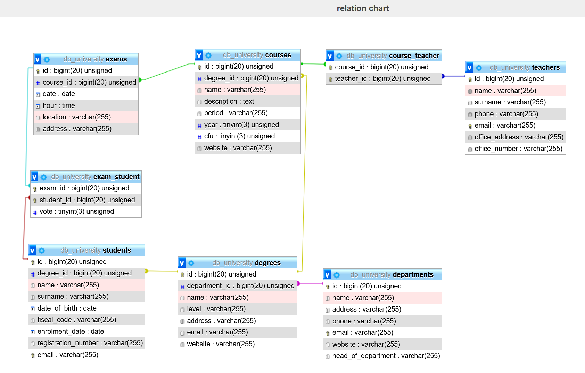

### Selezionare tutti gli studenti iscritti al Corso di Laurea in Economia
```bash
    SELECT `students`.* 
    FROM `degrees`
    JOIN `students`
    ON `degrees`.`id` = `students`.`degree_id`
    WHERE `degrees`.`id` = 53;
```
### Selezionare tutti i Corsi di Laurea Magistrale del Dipartimento di Neuroscienze
```bash
    SELECT `degrees`.* 
    FROM `departments` 
    JOIN `degrees`
    ON `departments`.`id` = `degrees`.`department_id`
    WHERE `departments`.`id` = 7
    AND `degrees`.`level` = 'magistrale';
```
### Selezionare tutti i corsi in cui insegna Fulvio Amato (id=44)
```bash
    SELECT `courses`.*
    FROM `teachers` 
    JOIN `course_teacher` 
    ON `teachers`.`id` = `course_teacher`.`teacher_id` 
    JOIN `courses` ON `course_teacher`.`course_id` = `courses`.`id` 
    WHERE `teachers`.`id` = 44; 
```
### Selezionare tutti gli studenti con i dati relativi al corso di laurea a cui sono iscritti e il relativo dipartimento, in ordine alfabetico per cognome e nome
```bash
    SELECT `students`.`surname`,`students`.`name`,`students`.`registration_number`,`degrees`.*,`departments`.`name`
    FROM `students` 
    JOIN `degrees`
    ON `students`.`degree_id` = `degrees`.`id`
    JOIN  `departments` 
    ON `degrees`.`department_id` = `departments`.`id`
    ORDER BY `students`.`surname` ASC,`students`.`name` ASC;
```
## Schema di riferimento

### Selezionare tutti i corsi di laurea con i relativi corsi e insegnanti
```bash
    SELECT `degrees`.`name` AS 'percorso di laurea',`courses`.`name`AS 'corsi',`teachers`.`name`AS 'nome professore',`teachers`.`surname`AS 'cognome professore'
    FROM `degrees`
    JOIN `courses`
    ON `degrees`.`id` = `courses`.`degree_id`
    JOIN `course_teacher`
    ON `courses`.`id` = `course_teacher`.`course_id`
    JOIN `teachers`
    ON `course_teacher`.`teacher_id` = `teachers`.`id`
    ORDER BY `degrees`.`name` ASC,`courses`.`name` ASC;
```
### Selezionare tutti i docenti che insegnano nel Dipartimento di Matematica (54)
```bash
    SELECT DISTINCT `teachers`.* 
    FROM `departments` 
    JOIN `degrees` 
    ON `departments`.`id` = `degrees`.`department_id` 
    JOIN `courses` 
    ON `degrees`.`id` = `courses`.`degree_id` 
    JOIN `course_teacher` 
    ON `courses`.`id` = `course_teacher`.`course_id` 
    JOIN `teachers` 
    ON `course_teacher`.`teacher_id` = `teachers`.`id` 
    WHERE `departments`.`id`= 5; 
```
### BONUS: Selezionare per ogni studente quanti tentativi d'esame ha sostenuto per superare ciascuno dei suoi esami
```bash
    SELECT `students`.`surname`,`students`.`name`, COUNT(`exams`.`id`) AS 'numero tentativi'
    FROM `students`
    JOIN `exam_student`
    ON `students`.`id` = `exam_student`.`student_id`
    JOIN `exams`
    ON `exam_student`.`exam_id` = `exams`.`id`
    WHERE `exam_student`.`vote` >= 18
    GROUP BY `students`.`id`
    ORDER BY `students`.`surname` ASC, `students`.`name` ASC;
```